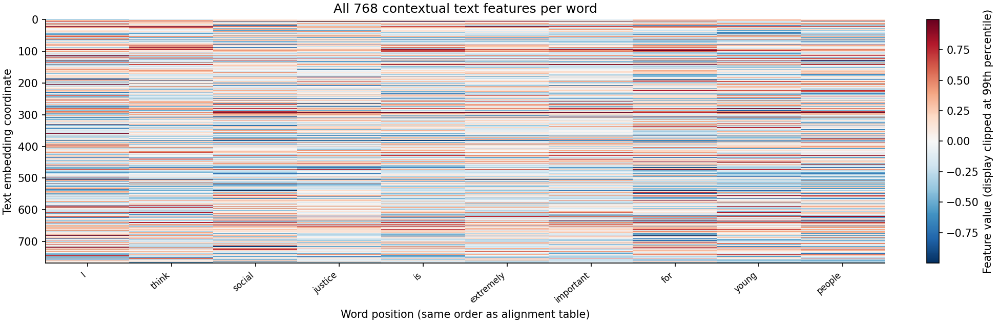

# 第一问结果报告

## 实际完成情况

本次从附件1原始视频自主提取特征，未使用附件2特征代替，未训练或微调情感模型。共生成 100/100 条样本的特征文件，总时长 787.50 秒，保留 1931 个完整词级位置。结构与数值复算检查发现 0 项错误。

| 指标 | 实测结果 |
|---|---:|
| 词级时间区间生成率 | 100.00% |
| 有效语音特征覆盖词比例 | 100.00% |
| 有效视觉特征覆盖词比例 | 82.91% |
| 采样视频帧人脸检测率 | 81.91% |
| 对齐低置信度词数 | 342 |
| 多人脸采样帧数 | 20 |
| 含质量复核提示的样本数 | 69 |
| 压缩特征文件总大小 | 14.28 MiB |

以上覆盖率不等同于对齐准确率。原数据没有人工逐词边界，本次未声称人工时间误差、识别准确率或情感预测成绩。低置信度位置保留在数据内并单独标记，建议按 manual_review_template.csv 进行人工回看。

本次有 18 条样本的平均对齐分数低于0.1。这些样本的赛题文本与模型直接识别出的语音文本往往差异较大，可能是转写与音频不匹配，也可能是识别失败。两种文本并列保存在 alignment_diagnostics.csv，供回听判断；未自行改写赛题文本或替换视频。合法CTC路径仅说明算法找到了受约束路径，不保证该样本具有可靠的语义时间对应。

## 方法与特征

1. 文本：冻结 DistilBERT 英文预训练编码器。按原文词语分组，对子词最后层向量求均值，得到每词768维上下文特征。原始转写全文与字符偏移保留。
2. 语音：音频按真实时间戳放入16kHz单声道时间轴。openSMILE eGeMAPSv02 提取25维低层描述符；按词区间的时间重叠长度加权计算均值、标准差，得到每词50维特征。这里不是整句88维统计特征。
3. 视觉：按10Hz目标频率选取具有真实PTS的视频帧；MediaPipe输出52个面部blendshape系数及3个头部欧拉角。按采样帧支持区间与词区间的重叠长度计算均值、标准差，得到每词110维特征。blendshape不是FACS动作单元，不应在论文中称为OpenFace AU。多人脸时选最大人脸并记录复核提示，不宣称已经验证其为说话人。
4. 对齐：冻结Wav2Vec2英文CTC声学模型，以赛题转写作为约束，用完整CTC状态转移和Viterbi算法寻找最大概率路径。重复字符之间必须经过blank；保留字符到原词的映射。时间分辨率约20ms，不代表实际边界误差小于20ms。
5. 数字读法：少数数字和序数词使用明确登记的英文展开；原文不改动。具体映射在metadata中。数字读法仍应通过视频回听核验。

若第i个词区间为I_i，原特征区间为J_j，则w_ij=|I_i∩J_j|m_j，μ_i=Σw_ij x_j/Σw_ij，σ_i=√[Σw_ij(x_j−μ_i)²/Σw_ij]。无有效贡献时特征置0，模态mask置False。检测失败与补齐位置分别记录。

存储采用完整变长序列，无50位置截断，不在磁盘上补齐。批量输入时按batch最大长度补0，padding_mask=True表示补齐；modality mask=True表示该模态具有有效观测。原始声学帧、视觉帧、支持区间和词间未分配区间均保留。未分配区间不自动等同于静音。

## 典型样本

样本：`-THoVjtIkeU$_$2`。选取规则为按原表顺序选择首条全部词可对齐、无低分词、人脸有效率超过80%且无多人脸采样帧的样本。这是展示用案例，不用于替代全量质量统计。

原文：I think social justice is extremely important for young people.

逐词时间、聚合帧数见 example_word_mapping.csv；每个词对应的源帧索引见该样本metadata JSON。图示用于可视核验，不构成人工边界精度测量。

## 质量分布

## 全量结果与提交

- sample_summary.csv：100条样本汇总，包括时长、维度、有效词数、提示信息。
- modality_summary.csv：每样本三行，100条样本共300行，可整理为论文全量结果表。
- word_alignment.csv：全部词的位置、时间区间、置信度与模态有效性。
- alignment_diagnostics.csv：赛题转写与声学模型直接识别文本的逐样本对照，用于排查异常，不用于替换原文。
- features/*.npz：三模态对齐特征及原始帧级数值特征。
- metadata/*.json：原始文本、标签、源视频相对路径、字符映射、聚合源帧索引及哈希。
- validation.json：自动结构校验与独立聚合复算的结果。
- run_environment.json：依赖版本、模型修订号、配置、模型及源文件哈希。

局限：语音转写与声学模型不匹配时可能强制对齐到错误位置；低置信度分数只是复核线索。人脸遮挡、画外音和多人脸会影响视觉可用性；最大人脸不一定是说话人。视觉10Hz抽样会遗漏更短暂的变化。本次尚未进行人工逐词精度标注或情感预测评价。

## 官方工具资料

- DistilBERT：https://huggingface.co/distilbert/distilbert-base-uncased
- Wav2Vec2：https://huggingface.co/facebook/wav2vec2-base-960h
- openSMILE：https://audeering.github.io/opensmile-python/usage.html
- MediaPipe：https://developers.google.com/edge/mediapipe/solutions/vision/face_landmarker/python
