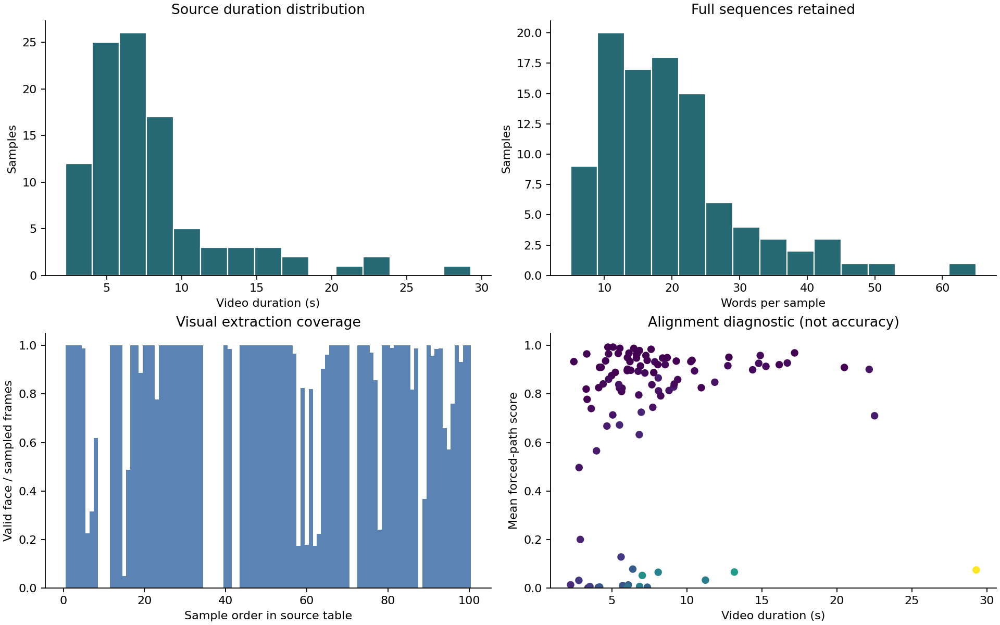
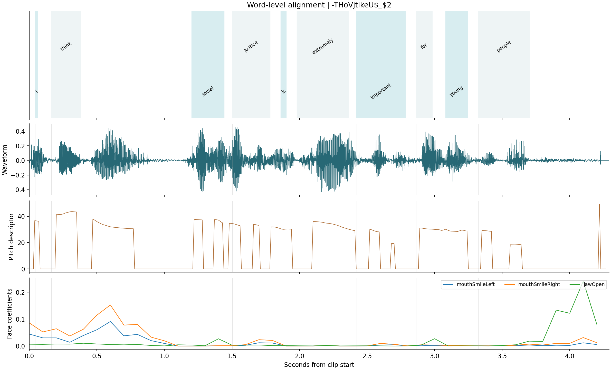
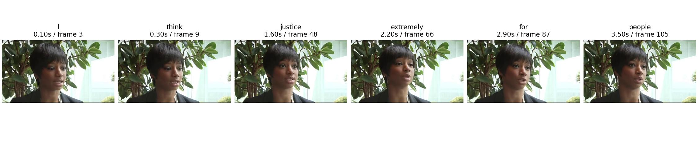
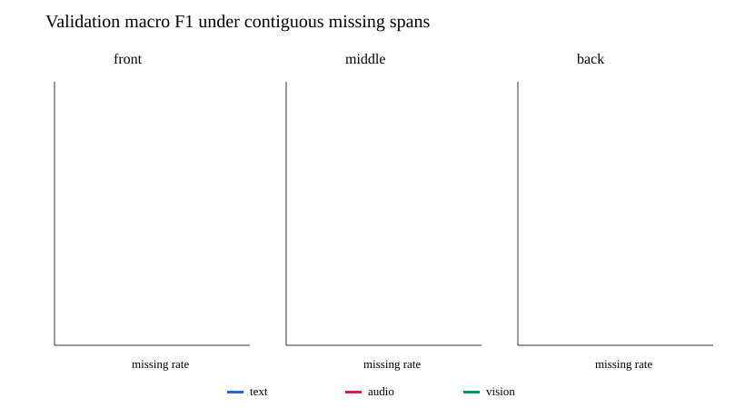

# 复杂场景下多模态情感识别的数学建模与算法设计

## 摘要

针对视频中语言、声音和面部信息的时间粒度不一致、局部观测缺失以及模型判断难以追溯的问题，本文依次建立词级特征提取与对齐模型、连续缺失条件下的情感预测模型，以及对最终预测器进行局部遮挡分析的解释模型。问题一对附件1全部100条视频自主提取变长词级特征：文本、语音、视觉维度为768、50、110，共形成1931个词位置，语音有效词覆盖1931/1931、视觉有效词覆盖1601/1931。问题二使用附件2对齐版的统一三字段输入，在训练集上学习参数，以验证集锁定双种子紧凑BERT与动态融合基线的集成预测器；完整输入的验证集准确率0.6044、宏平均F1为0.5763、MAE为0.6511、Pearson相关系数为0.5461。固定的连续遮挡实验表明，文本中段70%缺失时宏F1降至0.4816；对附件3的30条无标签样本完成极性与强度推理。问题三沿用锁定预测器，按验证集选择的连续窗口规则分析三模态敏感度，对附件4全部20条无标签样本输出预测、主要参考模态及可追溯的局部证据。20条样本的平均遮挡敏感度占比为文本0.7946、语音0.1263、视觉0.0791。本文严格区分有效位置、原始零值和人工遮挡；局部作用表示模型对指定扰动的响应，不解释为因果贡献。原视频时间定位由独立CTC模型自动估计，尚无人工逐词边界真值。

**关键词：**多模态情感识别；词级时序对齐；连续局部缺失；掩码融合；遮挡敏感度；可追溯解释

# 1 问题重述与研究路线

题目要求将原视频转换为可核查的文本、语音、视觉时序特征，在部分连续时间段的信息缺失条件下预测三类情感极性及−3至3的强度，并在完整三模态场景下指出模型的主要依据及其原素材位置。视频语言、表情和声学信号是不同步的异构序列；CMU-MOSEI研究提供了多模态情感分析的数据背景[1]，但本题各附件的字段、划分和无标签专项样本必须以赛题实际文件为准。

三问采取顺序相接、接口明确的方案。问题一从附件1原始视频自主构建词级表示和源帧索引；问题二在附件2的对齐版本上训练，在固定验证方案下比较连续缺失鲁棒性，并对附件3推理；问题三冻结问题二选定的预测器，只从附件2的valid选择解释窗口规则，最后对附件4推理并关联回原文本、音频和视频。问题一生成的768/50/110维特征与附件2的文本词元、74维语音和35维视觉输入并不同构，因此不直接代入问题二或三的预测模型。

# 2 数据边界、符号与基本假设

附件1用于原始视频特征提取。附件2的train、valid、test分别用于模型学习、模型选择和锁定后的独立评估；附件3和附件4均无情感标签，只作最终专项预测。问题二及三的统一数值输入为对齐版的text_bert、audio、vision。附件2额外的预计算text字段没有进入训练，以免训练与专项推理接口不一致。类别0、1、2分别表示负向、中性、正向；连续强度在[−3,3]内，只有强度恰好为0才属于真实中性标签。

设 $i$ 为样本、$m\in\{T,A,V\}$ 为模态、$t$ 为时序位置。$e_{it}^{m}$ 是有效位置掩码，$z_{it}^{m}$ 是原始特征整行零值的观察记录，$s_{it}^{m}$ 是实验程序明确生成的连续遮挡掩码。三者的含义不同；在预测阶段可观测位置为 $o_{it}^{m}=e_{it}^{m}(1-s_{it}^{m})$。填充位置不参加均值池化，原始零值成因未知，不能仅凭零向量断言人为缺失。

建模假设限定为：附件1原视频的解码时间戳可用作共同时间轴；词元顺序与题目转写的顺序一致；面部检测输出只代表该帧可观测的面部状态，不保证所检人脸一定为说话者；预训练编码器用于提取或初始化特征，不引入其他情感数据集。上述假设均可由源视频、模型清单和质量记录继续复核。

# 3 问题一：自主特征提取与时序对齐

## 3.1 词级公共时间轴

文本以原转写的词和字符偏移为锚点。冻结DistilBERT[2,3]生成子词上下文向量，将同一原词的子词向量求均值，得到每词768维表示。问题一提取模型的来源为distilbert/distilbert-base-uncased，修订号和文件哈希保存在模型清单中。原文、词元偏移与词序同时保存，避免后续只剩一个无法追溯的整句向量。

视频音轨按实际时间戳构建16 kHz单声道时间轴。冻结facebook/wav2vec2-base-960h声学模型[4]，以赛题转写作为约束，通过CTC路径[5]的Viterbi动态规划估计字符发射区间，再聚合为词区间。若 $\pi$ 为含blank的逐帧路径、$B(\pi)$ 为去重及去blank后的转写，则求

$$
\pi^\star=\underset{\pi:B(\pi)=y}{\arg\max}\sum_{t=1}^{L}\log P_t(\pi_t).
$$

重复字符之间必须经过blank状态。CTC路径存在仅说明找到了约束下的最优路径，不保证该位置是人工核实的词边界。模型来源、权重修订号和预处理版本在问题一运行环境记录中留存。

## 3.2 声学与视觉特征

声学分支使用openSMILE[6]的eGeMAPSv02帧级低层描述符[7]，每帧25维；在每词时间区间内计算25维均值与25维标准差，构成50维词级特征。25维是本次程序实际读出的帧级描述符，不是整句88维函数统计。音轨中的基频为零、静音或背景噪声也不自动等同于缺失。

视觉分支按目标10 Hz频率从真实解码时间戳选帧，先将视频宽度限制到640像素，再用MediaPipe Face Landmarker[8]提取52个面部blendshape系数和3个头部姿态欧拉角，形成55维帧级向量。与声学分支同理，词级均值和标准差拼接后为110维。blendshape并非FACS动作单元。无脸、检测失败及多人脸情况分别保留质量标记；多人脸时选取最大人脸，但不据此认定其就是发言者。

对词区间 $I_i$ 与原始帧支持区间 $J_j$，以有效掩码 $m_j$ 定义时间重叠权重 $w_{ij}=|I_i\cap J_j|m_j$，并计算

$$
\mu_i=\frac{\sum_jw_{ij}x_j}{\sum_jw_{ij}},\qquad
\sigma_i=\sqrt{\frac{\sum_jw_{ij}(x_j-\mu_i)^2}{\sum_jw_{ij}}}.
$$

当权重和为零时，词级向量置零、对应有效掩码置False，不能把该位置视为已获得真实零值观测。聚合时使用float64累加，保存为float32。磁盘上的样本保留完整变长序列、原始帧级数值、时间区间和源帧索引；只有批量读取时按批内长度填充。

## 3.3 实测结果、典型样本与局限

附件1全部100条原视频均生成了特征文件，共1931个词级位置；按解码时间轴的总时长为787.5022秒。1931/1931个词具有有效语音贡献，1601/1931个词具有有效视觉贡献，视觉覆盖率82.91%；采样视频帧的人脸检测率为81.91%。存在342个低置信度词、20个多人脸采样帧、69条带质量复核提示的样本，其中18条样本的平均对齐分数低于0.1。结构与聚合复算检查未发现错误。这些数字是生成覆盖和程序核查结果，不是人工逐词边界准确率或情感预测准确率。

按事先固定的展示条件选择一条文字、语音、视觉均可关联且人脸有效率超过80%的样本，其词区间、声学帧与视频帧的对应如下图。该图仅展示可追溯关系，尚无人工词边界用于计算时间误差。

每条结果采用独立NPZ和元数据JSON存储，完整100条汇总见文末附表A-1；逐词时间、源帧索引与模型文件哈希见[问题一结果说明](../question1/results/第一问结果报告.md)及配套文件。运行环境为Python 3.12.14、openSMILE 2.6.0、MediaPipe 0.10.21、Transformers 4.57.6，固定种子20260923；音频采样率16 kHz、视频目标采样10 Hz、低置信度复核阈值0.1。所有规则写在[问题一配置](../question1/config.json)中。低分对齐、未检出人脸和可能的转写不匹配均需人工抽查；本研究没有对附件1标注人工逐词边界真值。

# 4 问题二：模态局部缺失条件下的鲁棒情感预测

## 4.1 问题分析与建模思路

本问要求在文本、语音、视觉的某些连续时间段不可用时，同时预测情感极性与强度，并分析缺失模态、发生位置及持续时长对性能的影响。CMU-MOSEI 的原始研究给出了文本、语音、视觉联合情感分析的数据背景[1]；已有研究也讨论了不完整及混合模态缺失问题[9]。由题意，局部缺失是有效时段内的连续区间，不能把序列尾部填充或原始特征中的零值直接当作人为缺失。本节采用“显式位置掩码—模态时序编码—覆盖率感知融合—分类与回归联合学习”的路径：先建立可核查的有效位置与人工遮挡记录，再在统一的三字段输入上训练模型，最后以预先固定的缺失方案对模型进行压力验证。

附件2的 `aligned_50.pkl` 用于建模，按 train/valid/test 原有划分组织。模型参数只在 train 上更新；valid 用于轮次、结构和融合权重选择。模型锁定后，对 test 仅作一次独立评价。附件3的30条对齐版样本没有情感标签，仅用于接口核查与最终预测。本文不把附件3的零值比例用于设定训练遮挡概率，也不根据其预测结果调参。

## 4.2 符号、假设与数据预处理

设样本编号为 $i$，模态 $m\in\{T,A,V\}$ 分别表示文本、语音和视觉，时序位置 $t=1,\ldots,50$。主要符号如下。

|符号|含义|
|---|---|
|$x_{i,t}^{m}$|样本 $i$ 的模态 $m$ 在位置 $t$ 的输入特征|
|$e_{i,t}^{m}$|原始序列中该位置是否有效|
|$z_{i,t}^{m}$|原始特征是否为零值的审计记录|
|$s_{i,t}^{m}$|训练或验证时明确生成的人工连续遮挡位置|
|$o_{i,t}^{m}$|模型可观测位置，$o_{i,t}^{m}=e_{i,t}^{m}(1-s_{i,t}^{m})$|
|$r_i^m,c_i^m,w_i^m$|模态表示、有效覆盖率与样本级融合权重|
|$p_i,\hat y_i$|三类情感概率与预测类别|
|$\hat q_i$|连续情感强度预测|

采用以下数据处理前提：（1）以附件2已对齐的50位置序列为共同时间轴；（2）有效时段外的尾部位置为填充，音视频序列两端的结构性零位不参与池化；（3）有效内部的原始整行零值只作为观察事实记录，不能凭零值本身判定其成因。文本有效位由 `text_bert` 注意力掩码确定；音视频有效位由共同序列长度和两端结构位置确定。人工连续遮挡由生成过程单独记录，故 $z$ 与 $s$ 不混用。

本题训练集、验证集和独立测试集分别有3395、728、727条样本。标签核验得到：类别0为负向（强度 $q<0$），类别1为中性（$q=0$），类别2为正向（$q>0$），$q\in[-3,3]$。三种数据均由 `text_bert`、`audio`、`vision` 进入同一预处理接口；附件2另有的768维 `text` 字段未用于训练。附件3的 `text_bert` 虽以浮点数组保存，逐元素校验整数性后才转为词元编号。

音视频特征仅用 train 有效位置估计标准化参数：

$$
\mu_{m,d}=\frac{\sum_{i,t}e_{i,t}^{m}x_{i,t,d}^{m}}{\sum_{i,t}e_{i,t}^{m}},\qquad
\sigma_{m,d}=\sqrt{\frac{\sum_{i,t}e_{i,t}^{m}(x_{i,t,d}^{m}-\mu_{m,d})^2}{\sum_{i,t}e_{i,t}^{m}}},\qquad
\widetilde{x}_{i,t,d}^{m}=\operatorname{clip}\!\left(\frac{x_{i,t,d}^{m}-\mu_{m,d}}{\max(\sigma_{m,d},10^{-4})},-8,8\right).
$$

训练集中语音第0位置3395/3395条为零；有效内部出现整行零值的样本，音频有4条、视觉有421条。故统计标准化、时序汇总和覆盖率时均保留有效内部原始零位。附件3有29/30条样本的音视频原始零位模式一致，27/30条在文本有效时段内部存在零值；这些统计不能证明零值均由人为缺失产生。

## 4.3 鲁棒预测模型

先构建普通轻量基线：三模态分别经投影与一维卷积编码，并在可观测位置进行均值和最大值池化。鲁棒模型沿用音视频时序编码，文本分支采用 BERT 编码结构[2]，具体使用紧凑模型研究[10]发布的 Google BERT Tiny `bert_uncased_L-2_H-128_A-2` 权重[11]，将首词元池化表示与有效词元均值连接后投影。该编码器为两层、隐藏维128、双注意力头；初始化权重 SHA-256 为 `7fb69ad9f6866d8983183c930e33828f326470bf6ad8bbb2ad4ed957a92e9414`。文本、音频和视觉的编码结果分别记为 $r_i^T,r_i^A,r_i^V$。模型没有使用其他情感数据集。

对每个模态计算保留覆盖率

$$
c_i^m=\frac{\sum_t o_{i,t}^m}{\max(1,\sum_t e_{i,t}^m)}.
$$

把模态表示与覆盖率共同送入门控层，得到随样本变化的融合权重：

$$
a_i^m=g_m([r_i^m,c_i^m]),\quad
w_i^m=\frac{\exp(a_i^m)}{\sum_{k\in\{T,A,V\}}\exp(a_i^k)},\quad
r_i=\sum_m w_i^m r_i^m.
$$

覆盖率为零的模态在归一化前被屏蔽。分类头和强度头以融合表示、三模态表示及覆盖率为输入，分别输出 $p_i=\operatorname{softmax}(f_{\mathrm{cls}}(\cdot))$ 与 $\hat q_i=3\tanh(f_{\mathrm{reg}}(\cdot))$。$w_i^m$ 反映模型内部的动态分配，不等于模态对预测的因果贡献。

训练目标是类别加权交叉熵与 Huber 损失[12]之和：

$$
\mathcal L=\frac{\sum_{i=1}^{N}\alpha_{y_i}\bigl[-\log p_i(y_i)\bigr]}{\sum_{i=1}^{N}\alpha_{y_i}}
+\lambda\,\frac1N\sum_{i=1}^{N}\operatorname{Huber}_{\delta=1}(\hat q_i-q_i),\qquad
\alpha_k\propto n_k^{-1/2},\quad\lambda=0.5.
$$

其中 $n_k$ 只由 train 的类别计数得到。每个训练轮次约25%的样本保持完整，其余随机选择一个或两个模态，在有效内部生成一个连续缺失区间；长度从10%、25%、40%、55%、70%五档中抽取，起点随机。普通基线、消融模型和鲁棒模型在验证时使用同一组固定遮挡。优化模型采用 AdamW[13]，批量64，BERT学习率 $3\times10^{-5}$、预测头学习率 $10^{-3}$，至多训练12轮，耐心值3。Pearson项及完整/缺失一致性项未加入最终目标；后者在 train 内检查折未达到预设采用门槛。

最终参考预测集成的基本思想[14]，采用两个独立随机种子训练的鲁棒模型，并结合普通动态融合模型的分类概率：

$$
p_i^{\mathrm{final}}=0.85\frac{p_i^{B_1}+p_i^{B_2}}{2}+0.15p_i^{F},\qquad
\hat q_i^{\mathrm{final}}=\frac{\hat q_i^{B_1}+\hat q_i^{B_2}}{2}.
$$

0.15融合权重来自 valid 上有限候选比较；两个鲁棒分支等权预先固定。模型选择及最终指标不使用附件3标签。预训练文本编码器为两层、隐藏维128、双注意力头的 Google BERT Tiny；来源和权重校验值见[复现实验说明](../问题2/README.md)。

## 4.4 求解、指标与消融设计

分类评价采用 Accuracy 和三类宏平均 F1，回归评价采用 MAE 与 Pearson 相关系数。其中

$$
\operatorname{MacroF1}=\frac13\sum_{k=0}^{2}\frac{2P_kR_k}{P_k+R_k},\qquad
\operatorname{MAE}=\frac1N\sum_i|\hat q_i-q_i|.
$$

基线和消融分别检验连续缺失增强、显式人工遮挡掩码、动态融合权重的作用；`no_mask` 仍排除填充位。表4-1列出 valid 完整输入的真实运行结果，四指标顺序为 Accuracy、宏 F1、MAE、Pearson。

|方案|Accuracy|宏 F1|MAE|Pearson|
|---|---:|---:|---:|---:|
|普通基线|0.5165|0.4743|0.7220|0.4200|
|无连续缺失增强|0.5275|0.4985|0.7429|0.4146|
|无显式人工遮挡掩码|0.5288|0.5114|0.7262|0.4315|
|固定融合权重|0.4945|0.4917|0.7263|0.4431|
|普通动态融合|0.5453|0.5175|0.7324|0.4359|
|BERT Tiny 单分支|0.5769|0.5449|0.6779|0.5439|
|最终双种子融合|**0.6044**|**0.5763**|**0.6511**|**0.5461**|

表4-1的消融不是单因素因果估计：各方案分别训练并由 valid 选轮次。其用途是比较相同数据划分和遮挡方案下的预测表现。最终模型在 valid 上选定，故表中最优值可能包含选择偏倚。

## 4.5 缺失因素实验与规律

固定验证方案共50种：完整输入1种，单模态缺失 $3\times3\times5=45$ 种，双模态中段40%局部缺失3种，以及音视频有效内部全部遮挡的“仅文本可用”1种。图4-1展示45种单模态条件的宏 F1 变化；[完整指标表](../问题2/results/modeling_experiment/validation_scenarios.csv)还包含每个条件的 Accuracy、MAE、Pearson。

表4-2给出关键条件，便于与完整输入比较。

|valid 场景|Accuracy|宏 F1|MAE|Pearson|宏 F1 相对下降|
|---|---:|---:|---:|---:|---:|
|完整输入|0.6044|0.5763|0.6511|0.5461|0.0%|
|文本中段缺失40%|0.5673|0.5420|0.6804|0.4941|6.0%|
|文本中段缺失70%|0.5027|0.4816|0.7226|0.4060|16.4%|
|音频中段缺失70%|0.5907|0.5658|0.6423|0.5522|1.8%|
|视觉中段缺失70%|0.5989|0.5744|0.6471|0.5450|0.3%|
|音频与视觉同时中段缺失40%|0.5920|0.5657|0.6448|0.5497|1.8%|
|仅文本可用|0.5536|0.5489|0.6591|0.5298|4.8%|

在45个单模态条件中，文本缺失的平均宏 F1 为0.5350，音频为0.5710，视觉为0.5720；文本局部缺失影响最大。按位置汇总，前、中、后段分别为0.5657、0.5554、0.5569，中段平均较低，但不足以说明固定位置具有普遍因果重要性。按缺失长度比例汇总，10%、25%、40%、55%、70%的平均宏 F1 依次为0.5701、0.5656、0.5596、0.5559、0.5456，总体随连续缺失区间增加而下降。音视频同时缺失与仅文本可用场景单列，避免以单模态实验替代组合缺失结论。

模型锁定后，在附件2 test 的727条样本上按预先固定方案做一次独立评价，未据此重新选模型。完整输入 Accuracy 为0.6039、宏 F1 为0.5511、MAE 为0.7295、Pearson 为0.5495；文本中段缺失70%时四指标为0.5488、0.5123、0.7700、0.4774。test 的完整分类准确率与 valid 接近，但宏 F1 下降0.0252，说明类别平衡表现未完全复现。test 数据只作此处泛化核查，其[五场景结果](../问题2/results/final_test/test_metrics.csv)不参与任何模型调整。

## 4.6 附件3专项预测结果

对附件3对齐版30条样本采用完全相同的输入接口推理，样本编号直接取源文件名。预测极性为负向2条、中性12条、正向16条；预测强度最小值为−1.5491，中位数为0.4218，最大值为1.1858。表4-3展示全部样本的极性和强度预测，完整概率与机器可读结果见[附件3预测 CSV](../问题2/results/modeling_experiment/attachment3_predictions_two_seed.csv)。附件3没有真实标签，以下均为预测值，不能据此报告准确率。

|样本编号（源文件名，不含扩展名）|极性类别|预测情感强度|
|---|---|---:|
|附件3_01|1（中性）|0.0031|
|附件3_02|1（中性）|0.2000|
|附件3_03|2（正向）|0.4911|
|附件3_04|2（正向）|0.6614|
|附件3_05|0（负向）|-1.5491|
|附件3_06|2（正向）|0.9595|
|附件3_07|1（中性）|0.0600|
|附件3_08|1（中性）|0.4363|
|附件3_09|2（正向）|1.1858|
|附件3_10|1（中性）|-0.0162|
|附件3_11|2（正向）|0.5366|
|附件3_12|1（中性）|0.3198|
|附件3_13|2（正向）|0.4346|
|附件3_14|2（正向）|0.0597|
|附件3_15|2（正向）|1.0775|
|附件3_16|2（正向）|1.1293|
|附件3_17|1（中性）|0.1771|
|附件3_18|1（中性）|0.0409|
|附件3_19|1（中性）|0.3161|
|附件3_20|1（中性）|0.3983|
|附件3_21|2（正向）|0.5219|
|附件3_22|2（正向）|0.1235|
|附件3_23|1（中性）|0.4606|
|附件3_24|0（负向）|0.0436|
|附件3_25|1（中性）|0.2525|
|附件3_26|2（正向）|0.4091|
|附件3_27|2（正向）|0.5059|
|附件3_28|2（正向）|0.6158|
|附件3_29|2（正向）|0.7415|
|附件3_30|2（正向）|0.6049|

## 4.7 误差分析、模型评价与局限

独立 test 的完整输入混淆矩阵按负、中、正顺序为

$$
\begin{bmatrix}
121&41&45\\
34&52&72\\
44&52&266
\end{bmatrix}.
$$

其中中性158条仅正确识别52条，72条判为正向，造成中性类 F1 仅0.3432；负向与正向类 F1 分别为0.5961和0.7141。验证集[高误差案例表](../问题2/results/modeling_experiment/error_cases.csv)记录12条误分类样本的预测残差、有效长度及原始零值计数，可供回查原始视频。当前证据支持“中性判正向较多”和“长文本缺失下性能下降”的统计归因，不能仅凭门控权重或零值位置断言具体语义、声学或视觉成因。

本模型同时输出分类概率和连续强度，两头没有强制执行预测类别与强度符号的一致性。因此附件3中有13/30条的类别与回归强度符号不一致；这不是对真实标签映射的重新定义，写作和提交时须保留两个输出的原义。未来可在新的训练划分中检验符号一致性约束，但本次 test 已用于最终独立评价，不能再据此修改模型。其余限制包括有效内部原始零值成因不明、固定遮挡规则不能覆盖所有采集故障、valid 已用于多轮模型选择等。

本节完整指标、配置、训练代码和模型权重见[复现实验说明](../问题2/README.md)与[最终实验报告](../问题2/第二问最终报告.md)。附件3的30行预测 CSV 随论文作为专项结果文件提交。

# 5 问题三：可解释性多模态情感预测

## 5.1 问题分析与数据边界

本问沿用问题二已锁定的完整三模态集成预测器，不再训练第三问专用分类器。数值输入始终为附件2与附件4对齐版共有的 `text_bert`、`audio`、`vision`；附件2 train 训练的参数和标准化统计保持不变，valid 用于解释窗口宽度选择与性能评价。附件4的20条样本没有标签，仅在解释规则锁定后推理。问题一的100条自主提取特征（768/50/110维）与此模型的接口不同，不并入训练或直接输入预测器；本节复用问题一的独立音频CTC对齐思路定位原素材。

附件4的20条样本均有连续文本注意力，有效长度最小/中位/最大为13/30.0/50。有效区间内原始整行零值位置：语音0、视觉30；仅记录观察事实，不据此推断缺失成因。

## 5.2 预测与可解释模型

分类概率由两个BERT Tiny分支等权平均后，与普通动态融合模型按0.85/0.15加权；强度取两个BERT Tiny回归输出的均值。该模型的结构、交叉熵与Huber联合训练目标、连续缺失增强、参数来源及锁定规则见[问题二正文](../问题2/论文问题二正文.md)。本问借鉴遮挡敏感度分析的基本思想[15]，只对**最终集成输出**进行扰动解释，未把子模型注意力或门控权重直接当成因果贡献。

固定样本原预测类别 $\hat y_i$，在模态 $m$ 的有效内部移动连续窗口 $w$，以同一模型重新预测。令 $p_{i,\hat y_i}$ 为原类别概率，定义

$$\Delta_{imw}=p_{i,\hat y_i}(x_i)-p_{i,\hat y_i}(x_i\setminus w_m),\qquad \Delta^{(q)}_{imw}=\hat q_i(x_i)-\hat q_i(x_i\setminus w_m).$$

正的 $\Delta$ 表示遮挡后原类别概率下降，是对该判断的支持性证据；负值表示相反方向。定义作用量与占比

$$R_{im}=|\mathcal W_{im}|^{-1}\sum_{w\in\mathcal W_{im}}|\Delta_{imw}|,\qquad S_{im}=R_{im}/\sum_k R_{ik}.$$

原始零向量作为审计事实保留，不能自动视为人为缺失。解释时人工遮挡的掩码另行写入；两端特殊词元与填充位不参与窗口。所有有效窗口均纳入作用量统计；全零原始特征窗口仍可能通过覆盖率影响模型，但不作为可展示的关键内容证据候选。主要参考模态为 $R_{im}$ 最大者；该模态的局部证据取 $|\Delta|$ 最大的非全零有效窗口，保留其方向和强度变化，其他两模态也分别保存最显著窗口。占比是模型在此遮挡方案下的**敏感度比例**，不能解释成现实中的因果作用。

## 5.3 验证设计与真实结果

验证集完整输入共728条，实际 Accuracy=0.6044、宏 F1=0.5763、MAE=0.6511、Pearson=0.5461；这与问题二已锁定集成模型的完整输入指标一致。

解释验证从 valid 按真实类别固定种子各取30条，共90条；测试窗口长度3、5、7，步长1。对每条样本先取主模态中绝对变化最大的窗口，再扩大2位置，并与同模态同长度的随机窗口比较绝对概率变化。预先固定的选择分数是配对差值除以扩大后窗口长度的平方根。

|候选宽度|扩大后关键窗口平均变化|同长度随机窗口平均变化|平均配对差值|关键窗口更大比例|选择分数|
|---:|---:|---:|---:|---:|---:|
|3|0.1292|0.0816|0.0476|74.4%|0.0213|
|5|0.1475|0.0946|0.0529|67.8%|0.0200|
|7|0.1690|0.1134|0.0556|68.9%|0.0185|

按上述 valid 分数选定连续窗口宽度 **3**，附件4未参与选择。在该宽度下，扩大后的关键窗口比同长度随机窗口平均多改变 0.0476 的原类别概率。这一比较仍由同一模型的扰动响应产生，不能当成独立人工证据真值；部分优势由按最大变化选窗口的规则带来。

valid 子集的主要参考模态计数为文本89、语音1、视觉0；平均敏感度占比为0.7875/0.1482/0.0643。该子集有 35/90 条分类错误。高残差误判示例 `f_ZJ7L14oYQ$_$21`：真实类2、预测类0，真实强度2.0000、预测强度-1.2288，主模态text。解释能呈现模型依赖，不保证其结论正确。

## 5.4 附件4原素材定位核查

通过本地 Wav2Vec2-CTC[4] 对原视频语音进行独立强制对齐，20/20条得到自动词时间，其中3条存在自动定位质量警示（CTC均值分数低1条、转写与声学模型直接识别文本相似度低3条，两类可重叠）；20/20条导出主证据的实际解码视频帧。20/20条样本的 BERT 词元编号均能由原始转写和问题一保存的 DistilBERT 英文词表[3]精确重建；2条文本超过50词元上限。视觉模态证据另导出19张帧图，1条样本的视觉模态没有可用的原始非零窗口，明确记为空证据。附件4只提供特征位置而不提供逐词时间戳，因此位置到时间是结合精确词元字符映射和重新计算的CTC词时间作出的**近似关联**；所有时间定位均标为需人工回听，质量警示样本另作标记，不能声称人工核验过。需逐条复核时可填写[人工回看记录模板](../问题3/results/manual_review_template.csv)，空白栏表示尚未完成。

追加AI辅助核对：对20条原视频做不输入参考转写的CTC自由解码，17条主证据时间得到支持，1条可能冲突，2条无法判定；20条主证据帧与源视频指定帧逐像素一致。自由解码与强制对齐共用声学模型，不能代替人工回听；详见[AI辅助核对报告](../问题3/AI辅助核对报告.md)。

## 5.5 三模态作用与专项测试全量输出

20条中主要参考模态计数为文本20、语音0、视觉0；平均敏感度占比依次为0.7946、0.1263、0.0791。预测类别计数为负向5、中性3、正向12。若机械按强度的符号和零值反推类别，有4/20条与分类头输出不一致；两头预测保持原义，不据附件4无标签数据调阈值。

文本在附件4的20条和valid解释子集的89/90条上占主导，说明当前预测器对文本连续遮挡更敏感。这只是模型与所选遮挡规则下的观察，不能推出语音、视觉在真实情感判断中不重要；模态相关性与训练后的模型偏好都可能影响占比。

|ID|极性|强度|主模态|文本/语音/视觉占比|关键位置|自动时间(s)|定位状态|
|---|---|---:|---|---|---|---|---|
|01|Positive|0.3613|text|0.73/0.21/0.07|[11,14) +|3.78–5.02|自动CTC定位_需人工回听|
|02|Neutral|0.0301|text|0.91/0.08/0.02|[10,13) −|1.44–1.92|自动CTC定位_需人工回听|
|03|Neutral|-0.0539|text|0.87/0.08/0.04|[5,8) +|1.04–1.60|自动CTC定位_需人工回听|
|04|Positive|0.9156|text|0.90/0.04/0.06|[12,15) +|2.48–3.24|自动CTC定位_需人工回听|
|05|Positive|0.7824|text|0.57/0.19/0.24|[13,16) +|4.64–5.44|自动CTC定位_需人工回听|
|06|Positive|0.4122|text|0.84/0.07/0.08|[21,24) +|3.96–5.12|自动CTC定位_需人工回听|
|07|Positive|0.8657|text|0.74/0.15/0.11|[19,22) +|5.00–7.02|自动定位质量警示_需人工回听|
|08|Positive|0.8108|text|0.77/0.11/0.12|[7,10) +|1.84–3.04|自动CTC定位_需人工回听|
|09|Negative|-1.5849|text|0.85/0.09/0.06|[6,9) +|1.22–1.60|自动CTC定位_需人工回听|
|10|Negative|-1.6864|text|0.87/0.07/0.06|[28,31) +|7.50–9.18|自动CTC定位_需人工回听|
|11|Negative|-0.7628|text|0.93/0.04/0.03|[2,5) +|0.62–1.34|自动CTC定位_需人工回听|
|12|Negative|-0.6204|text|0.72/0.22/0.06|[2,5) +|0.72–1.20|自动CTC定位_需人工回听|
|13|Positive|0.3930|text|0.79/0.20/0.01|[27,30) −|7.28–8.60|自动CTC定位_需人工回听|
|14|Positive|0.9444|text|0.77/0.12/0.12|[28,31) +|6.96–8.76|自动CTC定位_需人工回听|
|15|Positive|-0.0136|text|0.84/0.07/0.09|[3,6) −|0.78–1.76|自动定位质量警示_需人工回听|
|16|Negative|-1.4736|text|0.64/0.27/0.09|[5,8) +|0.80–1.58|自动CTC定位_需人工回听|
|17|Positive|1.0946|text|0.74/0.17/0.09|[6,9) +|2.82–3.82|自动CTC定位_需人工回听|
|18|Neutral|0.3006|text|0.74/0.15/0.11|[27,30) +|8.68–9.42|自动定位质量警示_需人工回听|
|19|Positive|0.7336|text|0.81/0.12/0.07|[15,18) −|5.34–6.74|自动CTC定位_需人工回听|
|20|Positive|1.0708|text|0.84/0.08/0.08|[14,17) +|2.96–3.78|自动CTC定位_需人工回听|

全量机器可读文件见[附件4预测与解释CSV](../问题3/results/attachment4_predictions_explanations.csv)；各模态关键证据、原文片段和对应时间见[证据窗口CSV](../问题3/results/evidence_windows.csv)；所有滑动窗口的概率与强度变化见[窗口明细](../问题3/results/target_windows.csv)。附件4没有真实标签，不报告其Accuracy、F1、MAE或Pearson。

## 5.6 典型解释卡及局部重要性

### 可追溯的支持性片段：附件4 11

预测类别 Negative，强度 -0.7628；主要参考模态 text。文本/语音/视觉作用占比分别为 0.9266/0.0441/0.0293。

主证据位置为 [2, 5)，原预测类别概率变化 0.2934（support），对应转写片段“would be ashamed”，自动定位时间 0.62—1.34 秒。定位状态：自动CTC定位_需人工回听。

视频帧由原视频在自动定位时间附近实际解码得到；仅有帧图不能证明该片段的语音与特征位置已人工对齐。

### 反向证据或定位质量警示案例：附件4 15

预测类别 Positive，强度 -0.0136；主要参考模态 text。文本/语音/视觉作用占比分别为 0.8449/0.0699/0.0852。

主证据位置为 [3, 6)，原预测类别概率变化 -0.1101（counter），对应转写片段“despite their poverty”，自动定位时间 0.78—1.76 秒。定位状态：自动定位质量警示_需人工回听。

视频帧由原视频在自动定位时间附近实际解码得到；仅有帧图不能证明该片段的语音与特征位置已人工对齐。

追加AI辅助复核提示：不输入参考转写的自由解码找到相似度0.973的短语，但其中点比原自动时间晚5.61秒。因此该自动时间及对应截图不能作为短语与视频同步的可靠证据；保留它作为定位失败案例，仍待人工回听。

## 5.7 局限与复现

连续遮挡既移除特征又改变显式覆盖率，因此敏感度包含两种变化的共同响应。模态间有互补与相关性，三模态占比不等于独立因果贡献。独立CTC的强制路径可能在转写与语音不符时给出低质量时间；附件4没有人工逐词边界，视频帧也不能单独证明词音同步。模型中性类别仍较难识别，错误预测同样可能具有看似清晰的局部解释。

问题三未新增可训练参数。Python、NumPy、PyTorch及新增视频/声学依赖版本见[README](../问题3/README.md)和[依赖文件](../问题3/requirements.txt)；固定种子、窗口候选与阈值见 `config.json`，实际选型见 `results/selection.json`。运行 `problem3.py all` 可从附件2 valid、问题二锁定检查点和附件4原视频重新生成全部结果；`problem3.py verify` 复算20条预测并核验CSV字段。原始赛题文件、大型问题一声学模型和问题二检查点均引用相邻目录，不复制进问题三提交目录。

# 6 综合评价与结论

## 6.1 三问之间的关系

问题一解决从原视频到可追溯词级表示的生成问题，输出完整变长序列、显式质量掩码和源帧对应；问题二以附件2已对齐特征为独立输入接口，解决连续局部缺失时的分类与回归预测；问题三冻结问题二模型，通过连续遮挡响应定位影响预测的模态和片段，再用原视频生成自动时间与关键帧。三问方法可衔接，但问题一的自提取特征与附件2的数值维度不同，不能把两套特征视为同一模型输入。

## 6.2 结果与适用范围

问题一完成100/100条视频的特征生成与结构检查，视觉有效词占82.91%；问题二最终模型在728条valid完整输入上达到Accuracy 0.6044、宏F1 0.5763、MAE 0.6511、Pearson 0.5461，在锁定后一次独立test完整输入上分别为0.6039、0.5511、0.7295、0.5495。连续缺失验证显示文本缺失，尤其较长的中段缺失，平均影响更大，但这是指定遮挡规则和该模型下的统计表现。问题三对附件4的20条无标签样本完成预测与解释，主要参考模态均为文本；此结论是模型敏感度，不是人类情感判断的因果规律。

## 6.3 局限

问题一缺少人工逐词时间真值，原始转写与音频不一致会使CTC强制对齐错误；问题三的原视频时间关联也因此需要人工回听，07、15、18号质量警示样本应优先复核。问题二的valid经历多轮模型选择，最终结果存在选择偏倚；中性类仍易被判为正向。分类与强度两头独立，专项预测中存在符号不一致输出，本文如实保留。附件3和附件4均无真实情感标签，不能对它们报告预测准确率，也不能用其零值比例反推缺失成因或调整模型。

## 6.4 可复现材料

训练代码、固定配置、所选检查点、100条自主特征、30条附件3预测和20条附件4预测与解释均由各问目录提供。三问技术附件候选包大小约47.6 MB，尚未纳入最终整合论文；正式提交时须重新核对论文与附件合计体积及身份信息。本文研究引用的外部论文和工具来源均在下列参考文献及[网络核验记录](参考文献网络核验.md)中列明，外部文献不作为本地实验成绩的证据。

# 参考文献

[1] BAGHER ZADEH A, LIANG P P, PORIA S, et al. Multimodal Language Analysis in the Wild: CMU-MOSEI Dataset and Interpretable Dynamic Fusion Graph[C]//Proceedings of the 56th Annual Meeting of the Association for Computational Linguistics. 2018: 2236-2246. DOI: 10.18653/v1/P18-1208. https://aclanthology.org/P18-1208/.

[2] DEVLIN J, CHANG M W, LEE K, et al. BERT: Pre-training of Deep Bidirectional Transformers for Language Understanding[C]//Proceedings of NAACL-HLT. 2019: 4171-4186. DOI: 10.18653/v1/N19-1423. https://aclanthology.org/N19-1423/.

[3] SANH V, DEBUT L, CHAUMOND J, et al. DistilBERT, a distilled version of BERT: smaller, faster, cheaper and lighter[EB/OL]. 2019. arXiv:1910.01108. https://arxiv.org/abs/1910.01108.

[4] BAEVSKI A, ZHOU Y, MOHAMED A, et al. wav2vec 2.0: A Framework for Self-Supervised Learning of Speech Representations[C]//Advances in Neural Information Processing Systems 33. 2020. https://proceedings.neurips.cc/paper/2020/hash/92d1e1eb1cd6f9fba3227870bb6d7f07-Abstract.html.

[5] GRAVES A, FERNÁNDEZ S, GOMEZ F, et al. Connectionist Temporal Classification: Labelling Unsegmented Sequence Data with Recurrent Neural Networks[C]//Proceedings of the 23rd International Conference on Machine Learning. 2006: 369-376. https://www.cs.toronto.edu/~graves/icml_2006.pdf.

[6] EYBEN F, WÖLLMER M, SCHULLER B. openSMILE: The Munich Versatile and Fast Open-Source Audio Feature Extractor[C]//Proceedings of the 18th ACM International Conference on Multimedia. 2010: 1459-1462. DOI: 10.1145/1873951.1874246. https://portal.fis.tum.de/en/publications/opensmile-the-munich-versatile-and-fast-open-source-audio-feature/.

[7] EYBEN F, SCHERER K R, SCHULLER B W, et al. The Geneva Minimalistic Acoustic Parameter Set (GeMAPS) for Voice Research and Affective Computing[J]. IEEE Transactions on Affective Computing, 2016, 7(2): 190-202. DOI: 10.1109/TAFFC.2015.2457417. https://doi.org/10.1109/TAFFC.2015.2457417.

[8] GOOGLE. Face landmark detection guide for Python[EB/OL]. [2026-09-25]. https://developers.google.com/edge/mediapipe/solutions/vision/face_landmarker/python.

[9] CHI H, YANG M, ZHU J, et al. Missing Modality meets Meta Sampling (M3S): An Efficient Universal Approach for Multimodal Sentiment Analysis with Missing Modality[C]//Proceedings of AACL-IJCNLP. 2022: 121-130. DOI: 10.18653/v1/2022.aacl-main.10. https://aclanthology.org/2022.aacl-main.10/.

[10] TURC I, CHANG M W, LEE K, et al. Well-Read Students Learn Better: On the Importance of Pre-training Compact Models[EB/OL]. 2019. arXiv:1908.08962. https://arxiv.org/abs/1908.08962.

[11] GOOGLE. BERT Miniatures: bert_uncased_L-2_H-128_A-2[EB/OL]. [2026-09-25]. https://huggingface.co/google/bert_uncased_L-2_H-128_A-2.

[12] HUBER P J. Robust Estimation of a Location Parameter[J]. The Annals of Mathematical Statistics, 1964, 35(1): 73-101. DOI: 10.1214/aoms/1177703732. https://doi.org/10.1214/aoms/1177703732.

[13] LOSHCHILOV I, HUTTER F. Decoupled Weight Decay Regularization[C]//International Conference on Learning Representations. 2019. arXiv:1711.05101. https://arxiv.org/abs/1711.05101.

[14] LAKSHMINARAYANAN B, PRITZEL A, BLUNDELL C. Simple and Scalable Predictive Uncertainty Estimation using Deep Ensembles[C]//Advances in Neural Information Processing Systems 30. 2017. https://proceedings.neurips.cc/paper/2017/hash/9ef2ed4b7fd2c810847ffa5fa85bce38-Abstract.html.

[15] ZEILER M D, FERGUS R. Visualizing and Understanding Convolutional Networks[C]//European Conference on Computer Vision. 2014: 818-833. https://cs.nyu.edu/~fergus/papers/zeilerECCV2014.pdf.

# 附录A 附件1全部100条样本的特征结果

附表A-1保留源样本编号。每条均含文本T、语音A、视觉V，词级对齐粒度；维度分别为768/50/110。时长按原视频解码时间轴，A/V为有效贡献词数。完整逐词时间、源帧索引和特征矩阵在问题一结果目录及技术附件中。

|编号|解码时长(s)|词数|模态及维度|对齐粒度|A有效词|V有效词|
|---|---:|---:|---|---|---:|---:|
|-3g5yACwYnA$_$13|5.5140|15|T768/A50/V110|词级|15|15|
|-3g5yACwYnA$_$3|14.3890|29|T768/A50/V110|词级|29|29|
|-3g5yACwYnA$_$2|9.3941|14|T768/A50/V110|词级|14|14|
|-3g5yACwYnA$_$9|8.8170|23|T768/A50/V110|词级|23|23|
|-3nNcZdcdvU$_$5|7.8680|18|T768/A50/V110|词级|18|18|
|-HwX2H8Z4hY$_$2|3.9821|7|T768/A50/V110|词级|7|1|
|-HwX2H8Z4hY$_$5|5.6530|9|T768/A50/V110|词级|9|2|
|-HwX2H8Z4hY$_$6|3.3581|7|T768/A50/V110|词级|7|5|
|-HwX2H8Z4hY$_$9|7.7340|22|T768/A50/V110|词级|22|0|
|-NFrJFQijFE$_$1|5.7460|16|T768/A50/V110|词级|16|0|
|-NFrJFQijFE$_$2|6.8560|18|T768/A50/V110|词级|18|0|
|-THoVjtIkeU$_$12|14.8961|39|T768/A50/V110|词级|39|39|
|-THoVjtIkeU$_$2|4.2920|10|T768/A50/V110|词级|10|10|
|-THoVjtIkeU$_$6|8.0971|30|T768/A50/V110|词级|30|30|
|-UuX1xuaiiE$_$1|10.3500|27|T768/A50/V110|词级|27|1|
|-UuX1xuaiiE$_$0|3.6334|9|T768/A50/V110|词级|9|6|
|-UuX1xuaiiE$_$3|4.1301|9|T768/A50/V110|词级|9|9|
|-UuX1xuaiiE$_$6|8.1140|22|T768/A50/V110|词级|22|22|
|-a55Q6RWvTA$_$3|22.1540|65|T768/A50/V110|词级|65|61|
|-aNfi7CP8vM$_$7|8.6950|18|T768/A50/V110|词级|18|18|
|-aqamKhZ1Ec$_$0|10.9667|14|T768/A50/V110|词级|14|14|
|-dxfTGcXJoc$_$1|16.1611|36|T768/A50/V110|词级|36|36|
|-dxfTGcXJoc$_$0|20.5000|40|T768/A50/V110|词级|40|32|
|-dxfTGcXJoc$_$2|16.6980|34|T768/A50/V110|词级|34|34|
|-dxfTGcXJoc$_$6|12.7351|28|T768/A50/V110|词级|28|28|
|-egA8-b7-3M$_$26|6.0310|15|T768/A50/V110|词级|15|15|
|-egA8-b7-3M$_$17|7.2711|16|T768/A50/V110|词级|16|16|
|-egA8-b7-3M$_$18|8.3861|22|T768/A50/V110|词级|22|22|
|-egA8-b7-3M$_$16|5.5381|11|T768/A50/V110|词级|11|11|
|-egA8-b7-3M$_$13|4.1840|11|T768/A50/V110|词级|11|11|
|-egA8-b7-3M$_$1|10.2661|20|T768/A50/V110|词级|20|20|
|-egA8-b7-3M$_$6|6.2650|12|T768/A50/V110|词级|12|12|
|-egA8-b7-3M$_$9|5.0900|10|T768/A50/V110|词级|10|10|
|-egA8-b7-3M$_$20|6.6450|20|T768/A50/V110|词级|20|20|
|-iRBcNs9oI8$_$3|5.6210|8|T768/A50/V110|词级|8|0|
|-iRBcNs9oI8$_$7|4.1040|9|T768/A50/V110|词级|9|0|
|-iRBcNs9oI8$_$6|2.9030|5|T768/A50/V110|词级|5|0|
|-iRBcNs9oI8$_$9|3.4160|5|T768/A50/V110|词级|5|0|
|-iRBcNs9oI8$_$8|8.0930|21|T768/A50/V110|词级|21|0|
|-lzEya4AM_4$_$5|7.6750|19|T768/A50/V110|词级|19|19|
|-lzEya4AM_4$_$6|14.7920|43|T768/A50/V110|词级|43|43|
|-mJ2ud6oKI8$_$1|6.1030|13|T768/A50/V110|词级|13|0|
|-mJ2ud6oKI8$_$2|5.7310|11|T768/A50/V110|词级|11|0|
|-mJ2ud6oKI8$_$6|2.2570|5|T768/A50/V110|词级|5|5|
|-mJ2ud6oKI8$_$9|7.0330|22|T768/A50/V110|词级|22|22|
|-mJ2ud6oKI8$_$8|4.1920|11|T768/A50/V110|词级|11|11|
|-mqbVkbCndg$_$0|6.4667|14|T768/A50/V110|词级|14|14|
|-t217m2on-s$_$2|5.6861|12|T768/A50/V110|词级|12|12|
|-t217m2on-s$_$7|17.1831|45|T768/A50/V110|词级|45|45|
|-tANM6ETl_M$_$3|6.7581|22|T768/A50/V110|词级|22|22|
|-tPCytz4rww$_$11|5.4670|17|T768/A50/V110|词级|17|17|
|-tPCytz4rww$_$10|4.7890|12|T768/A50/V110|词级|12|12|
|-tPCytz4rww$_$12|11.8640|26|T768/A50/V110|词级|26|26|
|-tPCytz4rww$_$16|7.2060|16|T768/A50/V110|词级|16|16|
|-tPCytz4rww$_$18|6.6450|16|T768/A50/V110|词级|16|16|
|-vxjVxOeScU$_$4|9.1271|21|T768/A50/V110|词级|21|21|
|-wMB_hJL-3o$_$7|6.0441|22|T768/A50/V110|词级|22|22|
|-wny0OAz3g8$_$1|6.8441|22|T768/A50/V110|词级|22|1|
|-wny0OAz3g8$_$0|3.3334|9|T768/A50/V110|词级|9|9|
|-wny0OAz3g8$_$3|6.1461|20|T768/A50/V110|词级|20|0|
|-wny0OAz3g8$_$2|6.6870|23|T768/A50/V110|词级|23|23|
|-wny0OAz3g8$_$5|6.9120|20|T768/A50/V110|词级|20|1|
|-wny0OAz3g8$_$7|8.0680|29|T768/A50/V110|词级|29|10|
|-wny0OAz3g8$_$9|6.2131|20|T768/A50/V110|词级|20|20|
|-571d8cVauQ$_$0|5.0667|12|T768/A50/V110|词级|12|12|
|-571d8cVauQ$_$5|15.2730|43|T768/A50/V110|词级|43|43|
|-I_e4mIh0yE$_$1|7.6221|18|T768/A50/V110|词级|18|18|
|-I_e4mIh0yE$_$3|9.1631|22|T768/A50/V110|词级|22|22|
|-UacrmKiTn4$_$10|7.3620|18|T768/A50/V110|词级|18|18|
|-UacrmKiTn4$_$4|4.7411|14|T768/A50/V110|词级|14|14|
|-hnBHBN8p5A$_$7|7.3720|13|T768/A50/V110|词级|13|0|
|-hnBHBN8p5A$_$6|6.4010|13|T768/A50/V110|词级|13|0|
|-qDkUB0GgYY$_$6|4.6780|16|T768/A50/V110|词级|16|16|
|-uywlfIYOS8$_$4|6.0450|18|T768/A50/V110|词级|18|18|
|-6rXp3zJ3kc$_$8|12.8051|34|T768/A50/V110|词级|34|34|
|-9y-fZ3swSY$_$0|6.8334|22|T768/A50/V110|词级|22|22|
|-9y-fZ3swSY$_$4|2.8211|9|T768/A50/V110|词级|9|9|
|-9y-fZ3swSY$_$8|4.9890|12|T768/A50/V110|词级|12|5|
|-AUZQgSxyPQ$_$2|22.5111|41|T768/A50/V110|词级|41|41|
|-HeZS2-Prhc$_$2|8.2620|16|T768/A50/V110|词级|16|16|
|-MeTTeMJBNc$_$0|9.3000|21|T768/A50/V110|词级|21|21|
|-MeTTeMJBNc$_$13|5.4301|14|T768/A50/V110|词级|14|14|
|-MeTTeMJBNc$_$7|10.5170|31|T768/A50/V110|词级|31|31|
|-RfYyzHpjk4$_$11|5.2390|17|T768/A50/V110|词级|17|17|
|-RfYyzHpjk4$_$8|4.5890|17|T768/A50/V110|词级|17|17|
|-RfYyzHpjk4$_$2|5.5161|25|T768/A50/V110|词级|25|24|
|-UUCSKoHeMA$_$0|7.8000|18|T768/A50/V110|词级|18|18|
|-ri04Z7vwnc$_$0|2.8070|8|T768/A50/V110|词级|8|0|
|-ri04Z7vwnc$_$2|6.0270|16|T768/A50/V110|词级|16|8|
|-ri04Z7vwnc$_$5|3.5450|8|T768/A50/V110|词级|8|8|
|-s9qJ7ATP7w$_$1|4.7920|11|T768/A50/V110|词级|11|11|
|-s9qJ7ATP7w$_$0|6.8000|24|T768/A50/V110|词级|24|24|
|-s9qJ7ATP7w$_$5|8.5611|19|T768/A50/V110|词级|19|19|
|-s9qJ7ATP7w$_$4|4.4271|9|T768/A50/V110|词级|9|6|
|-s9qJ7ATP7w$_$7|6.9661|28|T768/A50/V110|词级|28|14|
|-s9qJ7ATP7w$_$6|2.4750|5|T768/A50/V110|词级|5|5|
|-s9qJ7ATP7w$_$8|3.2950|12|T768/A50/V110|词级|12|12|
|-yRb-Jum7EQ$_$1|29.2881|49|T768/A50/V110|词级|49|49|
|-yRb-Jum7EQ$_$5|13.1691|25|T768/A50/V110|词级|25|25|
|-yRb-Jum7EQ$_$6|11.2426|19|T768/A50/V110|词级|19|19|

合计100条、1931个词位置；A有效1931词、V有效1601词。文件逐条对应情况见[问题一汇总CSV](../question1/results/sample_summary.csv)。
