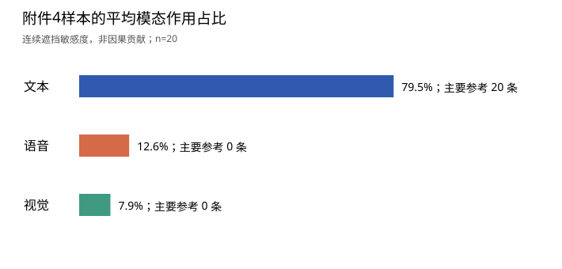
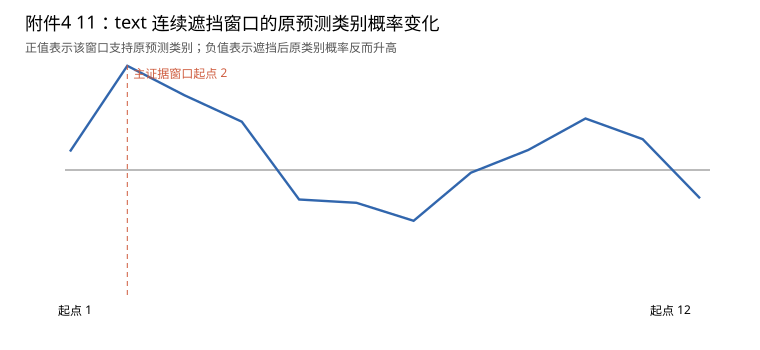
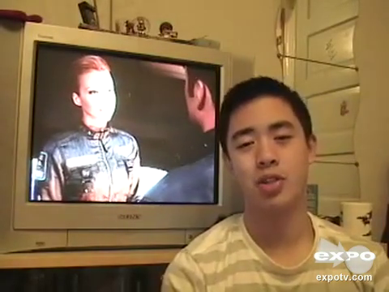

# 5 问题三：可解释性多模态情感预测

## 5.1 问题分析与数据边界

本问沿用问题二已锁定的完整三模态集成预测器，不再训练第三问专用分类器。数值输入始终为附件2与附件4对齐版共有的 `text_bert`、`audio`、`vision`；附件2 train 训练的参数和标准化统计保持不变，valid 用于解释窗口宽度选择与性能评价。附件4的20条样本没有标签，仅在解释规则锁定后推理。问题一的100条自主提取特征（768/50/110维）与此模型的接口不同，不并入训练或直接输入预测器；本节复用问题一的独立音频CTC对齐思路定位原素材。

附件4的20条样本均有连续文本注意力，有效长度最小/中位/最大为13/30.0/50。有效区间内原始整行零值位置：语音0、视觉30；仅记录观察事实，不据此推断缺失成因。

## 5.2 预测与可解释模型

分类概率由两个BERT Tiny分支等权平均后，与普通动态融合模型按0.85/0.15加权；强度取两个BERT Tiny回归输出的均值。该模型的结构、交叉熵与Huber联合训练目标、连续缺失增强、参数来源及锁定规则见[问题二正文](../问题2/论文问题二正文.md)。本问借鉴遮挡敏感度分析的基本思想[9]，只对**最终集成输出**进行扰动解释，未把子模型注意力或门控权重直接当成因果贡献。

固定样本原预测类别 $\hat y_i$，在模态 $m$ 的有效内部移动连续窗口 $w$，以同一模型重新预测。令 $p_{i,\hat y_i}$ 为原类别概率，定义

$$\Delta_{imw}=p_{i,\hat y_i}(x_i)-p_{i,\hat y_i}(x_i\setminus w_m),\qquad \Delta^{(q)}_{imw}=\hat q_i(x_i)-\hat q_i(x_i\setminus w_m).$$

正的 $\Delta$ 表示遮挡后原类别概率下降，是对该判断的支持性证据；负值表示相反方向。定义作用量与占比

$$R_{im}=|\mathcal W_{im}|^{-1}\sum_{w\in\mathcal W_{im}}|\Delta_{imw}|,\qquad S_{im}=R_{im}/\sum_k R_{ik}.$$

原始零向量作为审计事实保留，不能自动视为人为缺失。解释时人工遮挡的掩码另行写入；两端特殊词元与填充位不参与窗口。所有有效窗口均纳入作用量统计；全零原始特征窗口仍可能通过覆盖率影响模型，但不作为可展示的关键内容证据候选。主要参考模态为 $R_{im}$ 最大者；该模态的局部证据取 $|\Delta|$ 最大的非全零有效窗口，保留其方向和强度变化，其他两模态也分别保存最显著窗口。占比是模型在此遮挡方案下的**敏感度比例**，不能解释成现实中的因果作用。

## 5.3 验证设计与真实结果

验证集完整输入共728条，实际 Accuracy=0.6044、宏 F1=0.5763、MAE=0.6511、Pearson=0.5461；这与问题二已锁定集成模型的完整输入指标一致。

解释验证从 valid 按真实类别固定种子各取30条，共90条；测试窗口长度3、5、7，步长1。对每条样本先取主模态中绝对变化最大的窗口，再扩大2位置，并与同模态同长度的随机窗口比较绝对概率变化。预先固定的选择分数是配对差值除以扩大后窗口长度的平方根。

|候选宽度|扩大后关键窗口平均变化|同长度随机窗口平均变化|平均配对差值|关键窗口更大比例|选择分数|
|---:|---:|---:|---:|---:|---:|
|3|0.1292|0.0816|0.0476|74.4%|0.0213|
|5|0.1475|0.0946|0.0529|67.8%|0.0200|
|7|0.1690|0.1134|0.0556|68.9%|0.0185|

按上述 valid 分数选定连续窗口宽度 **3**，附件4未参与选择。在该宽度下，扩大后的关键窗口比同长度随机窗口平均多改变 0.0476 的原类别概率。这一比较仍由同一模型的扰动响应产生，不能当成独立人工证据真值；部分优势由按最大变化选窗口的规则带来。

valid 子集的主要参考模态计数为文本89、语音1、视觉0；平均敏感度占比为0.7875/0.1482/0.0643。该子集有 35/90 条分类错误。高残差误判示例 `f_ZJ7L14oYQ$_$21`：真实类2、预测类0，真实强度2.0000、预测强度-1.2288，主模态text。解释能呈现模型依赖，不保证其结论正确。

## 5.4 附件4原素材定位核查

通过本地 Wav2Vec2-CTC[10] 对原视频语音进行独立强制对齐，20/20条得到自动词时间，其中3条存在自动定位质量警示（CTC均值分数低1条、转写与声学模型直接识别文本相似度低3条，两类可重叠）；20/20条导出主证据的实际解码视频帧。20/20条样本的 BERT 词元编号均能由原始转写和问题一保存的 DistilBERT 英文词表[11]精确重建；2条文本超过50词元上限。视觉模态证据另导出19张帧图，1条样本的视觉模态没有可用的原始非零窗口，明确记为空证据。附件4只提供特征位置而不提供逐词时间戳，因此位置到时间是结合精确词元字符映射和重新计算的CTC词时间作出的**近似关联**；所有时间定位均标为需人工回听，质量警示样本另作标记，不能声称人工核验过。需逐条复核时可填写[人工回看记录模板](results/manual_review_template.csv)，空白栏表示尚未完成。

追加AI辅助核对：对20条原视频做不输入参考转写的CTC自由解码，17条主证据时间得到支持，1条可能冲突，2条无法判定；20条主证据帧与源视频指定帧逐像素一致。自由解码与强制对齐共用声学模型，不能代替人工回听；详见[AI辅助核对报告](AI辅助核对报告.md)。

## 5.5 三模态作用与专项测试全量输出

20条中主要参考模态计数为文本20、语音0、视觉0；平均敏感度占比依次为0.7946、0.1263、0.0791。预测类别计数为负向5、中性3、正向12。若机械按强度的符号和零值反推类别，有4/20条与分类头输出不一致；两头预测保持原义，不据附件4无标签数据调阈值。

文本在附件4的20条和valid解释子集的89/90条上占主导，说明当前预测器对文本连续遮挡更敏感。这只是模型与所选遮挡规则下的观察，不能推出语音、视觉在真实情感判断中不重要；模态相关性与训练后的模型偏好都可能影响占比。

|ID|极性|强度|主模态|文本/语音/视觉占比|关键位置|自动时间(s)|定位状态|
|---|---|---:|---|---|---|---|---|
|01|Positive|0.3613|text|0.73/0.21/0.07|[11,14) +|3.78–5.02|自动CTC定位_需人工回听|
|02|Neutral|0.0301|text|0.91/0.08/0.02|[10,13) −|1.44–1.92|自动CTC定位_需人工回听|
|03|Neutral|-0.0539|text|0.87/0.08/0.04|[5,8) +|1.04–1.60|自动CTC定位_需人工回听|
|04|Positive|0.9156|text|0.90/0.04/0.06|[12,15) +|2.48–3.24|自动CTC定位_需人工回听|
|05|Positive|0.7824|text|0.57/0.19/0.24|[13,16) +|4.64–5.44|自动CTC定位_需人工回听|
|06|Positive|0.4122|text|0.84/0.07/0.08|[21,24) +|3.96–5.12|自动CTC定位_需人工回听|
|07|Positive|0.8657|text|0.74/0.15/0.11|[19,22) +|5.00–7.02|自动定位质量警示_需人工回听|
|08|Positive|0.8108|text|0.77/0.11/0.12|[7,10) +|1.84–3.04|自动CTC定位_需人工回听|
|09|Negative|-1.5849|text|0.85/0.09/0.06|[6,9) +|1.22–1.60|自动CTC定位_需人工回听|
|10|Negative|-1.6864|text|0.87/0.07/0.06|[28,31) +|7.50–9.18|自动CTC定位_需人工回听|
|11|Negative|-0.7628|text|0.93/0.04/0.03|[2,5) +|0.62–1.34|自动CTC定位_需人工回听|
|12|Negative|-0.6204|text|0.72/0.22/0.06|[2,5) +|0.72–1.20|自动CTC定位_需人工回听|
|13|Positive|0.3930|text|0.79/0.20/0.01|[27,30) −|7.28–8.60|自动CTC定位_需人工回听|
|14|Positive|0.9444|text|0.77/0.12/0.12|[28,31) +|6.96–8.76|自动CTC定位_需人工回听|
|15|Positive|-0.0136|text|0.84/0.07/0.09|[3,6) −|0.78–1.76|自动定位质量警示_需人工回听|
|16|Negative|-1.4736|text|0.64/0.27/0.09|[5,8) +|0.80–1.58|自动CTC定位_需人工回听|
|17|Positive|1.0946|text|0.74/0.17/0.09|[6,9) +|2.82–3.82|自动CTC定位_需人工回听|
|18|Neutral|0.3006|text|0.74/0.15/0.11|[27,30) +|8.68–9.42|自动定位质量警示_需人工回听|
|19|Positive|0.7336|text|0.81/0.12/0.07|[15,18) −|5.34–6.74|自动CTC定位_需人工回听|
|20|Positive|1.0708|text|0.84/0.08/0.08|[14,17) +|2.96–3.78|自动CTC定位_需人工回听|

全量机器可读文件见[附件4预测与解释CSV](results/attachment4_predictions_explanations.csv)；各模态关键证据、原文片段和对应时间见[证据窗口CSV](results/evidence_windows.csv)；所有滑动窗口的概率与强度变化见[窗口明细](results/target_windows.csv)。附件4没有真实标签，不报告其Accuracy、F1、MAE或Pearson。

## 5.6 典型解释卡及局部重要性

### 可追溯的支持性片段：附件4 11

预测类别 Negative，强度 -0.7628；主要参考模态 text。文本/语音/视觉作用占比分别为 0.9266/0.0441/0.0293。

主证据位置为 [2, 5)，原预测类别概率变化 0.2934（support），对应转写片段“would be ashamed”，自动定位时间 0.62—1.34 秒。定位状态：自动CTC定位_需人工回听。

视频帧由原视频在自动定位时间附近实际解码得到；仅有帧图不能证明该片段的语音与特征位置已人工对齐。

### 反向证据或定位质量警示案例：附件4 15

预测类别 Positive，强度 -0.0136；主要参考模态 text。文本/语音/视觉作用占比分别为 0.8449/0.0699/0.0852。

主证据位置为 [3, 6)，原预测类别概率变化 -0.1101（counter），对应转写片段“despite their poverty”，自动定位时间 0.78—1.76 秒。定位状态：自动定位质量警示_需人工回听。

视频帧由原视频在自动定位时间附近实际解码得到；仅有帧图不能证明该片段的语音与特征位置已人工对齐。

追加AI辅助复核提示：不输入参考转写的自由解码找到相似度0.973的短语，但其中点比原自动时间晚5.61秒。因此该自动时间及对应截图不能作为短语与视频同步的可靠证据；保留它作为定位失败案例，仍待人工回听。

## 5.7 局限与复现

连续遮挡既移除特征又改变显式覆盖率，因此敏感度包含两种变化的共同响应。模态间有互补与相关性，三模态占比不等于独立因果贡献。独立CTC的强制路径可能在转写与语音不符时给出低质量时间；附件4没有人工逐词边界，视频帧也不能单独证明词音同步。模型中性类别仍较难识别，错误预测同样可能具有看似清晰的局部解释。

问题三未新增可训练参数。Python、NumPy、PyTorch及新增视频/声学依赖版本见[README](README.md)和[依赖文件](requirements.txt)；固定种子、窗口候选与阈值见 `config.json`，实际选型见 `results/selection.json`。运行 `problem3.py all` 可从附件2 valid、问题二锁定检查点和附件4原视频重新生成全部结果；`problem3.py verify` 复算20条预测并核验CSV字段。原始赛题文件、大型问题一声学模型和问题二检查点均引用相邻目录，不复制进问题三提交目录。

## 参考文献（问题三增补）

[9] ZEILER M D, FERGUS R. Visualizing and Understanding Convolutional Networks[C]//European Conference on Computer Vision. 2014: 818-833. [作者论文](https://cs.nyu.edu/~fergus/papers/zeilerECCV2014.pdf).

[10] BAEVSKI A, ZHOU Y, MOHAMED A, et al. wav2vec 2.0: A Framework for Self-Supervised Learning of Speech Representations[C]//Advances in Neural Information Processing Systems 33. 2020. [原文](https://proceedings.neurips.cc/paper/2020/hash/92d1e1eb1cd6f9fba3227870bb6d7f07-Abstract.html).

[11] SANH V, DEBUT L, CHAUMOND J, et al. DistilBERT, a distilled version of BERT: smaller, faster, cheaper and lighter[EB/OL]. 2019. arXiv: 1910.01108. [原文](https://arxiv.org/abs/1910.01108).

[9]只支持遮挡敏感度的分析思想，本研究的时序窗口、模态占比与验证数值均由本地实验定义和计算。全文合并时须统一参考文献编号。
